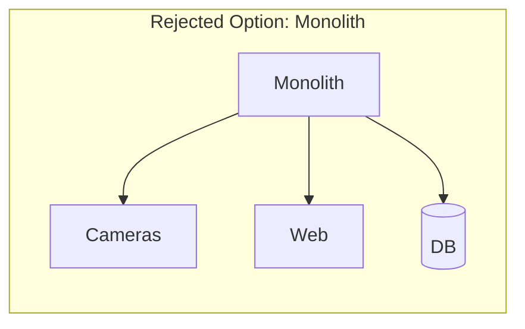
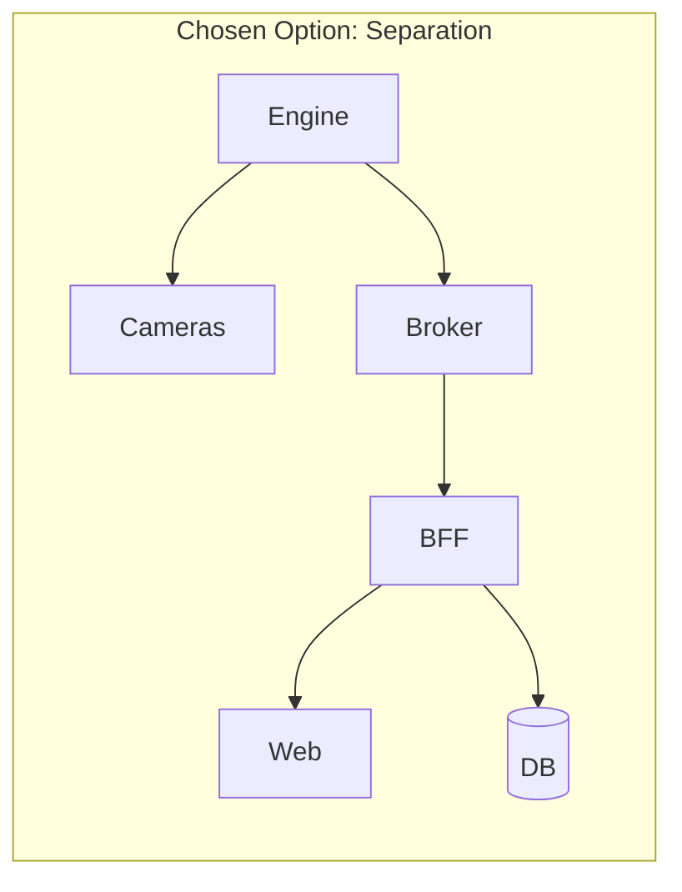

# ADR-001: Separated Services vs Monolith

**Status:** Accepted  
**Date:** February 2026

## Context

We needed to decide whether Argos should be a single monolithic application or separate services (Engine, BFF, Web).

## Options

### Option A: Monolith (Rejected)

A single application handling cameras, web serving, and database.

**Cons:** Tightly coupled, can't scale AI processing independently, language lock-in.

### Option B: Service Separation (Chosen)

Engine (Python) handles AI/video, BFF (TypeScript) handles API/auth, Web (Next.js) handles UI.

## Decision

**Separation.** Each service uses the best language for its domain:
- **Engine:** Python (OpenCV, LangChain, AI/ML ecosystem)
- **BFF:** TypeScript (Fastify, Kafka, REST/SSE)
- **Web:** TypeScript (Next.js, React)

## Consequences

- Kafka required for event streaming (Engine → BFF); HTTP webhooks for config propagation (BFF → Engine)
- Independent deployment and scaling per service
- Clear team boundaries and documentation per service
