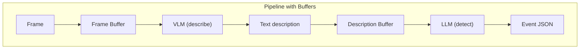

# ADR-002: Two-Stage AI Pipeline with Buffers

**Status:** Accepted  
**Date:** February 2026

## Context

The engine needs to analyze video frames and detect events. We needed to decide whether to use a single VLM call or a multi-stage pipeline.

## Options

### Option A: VLM Only (Rejected)

Pass each frame to a VLM with a complex prompt that both describes and classifies.

**Cons:** Expensive per call, no temporal awareness, prompt complexity.

### Option B: Pipeline with Buffers (Chosen)

Separate observation (VLM) from detection (LLM), connected by buffers.

## Decision

**Two-stage pipeline.** The VLM describes what it sees; the LLM analyzes descriptions over time and decides if events occurred.

## Consequences

- Buffers decouple stages, allowing independent batch sizes and rates
- LLM gets temporal context (multiple descriptions over time)
- Cheaper: VLM does simple description, LLM does reasoning
- More testable: each stage can be tested independently
- The buffer boundary naturally enables per-camera concurrent processing: each camera's VLM loop and LLM loop run as independent asyncio tasks, signaling each other via `asyncio.Event` when a buffer threshold is crossed (see [ADR-004](./004-concurrent-per-camera-processing.md))
