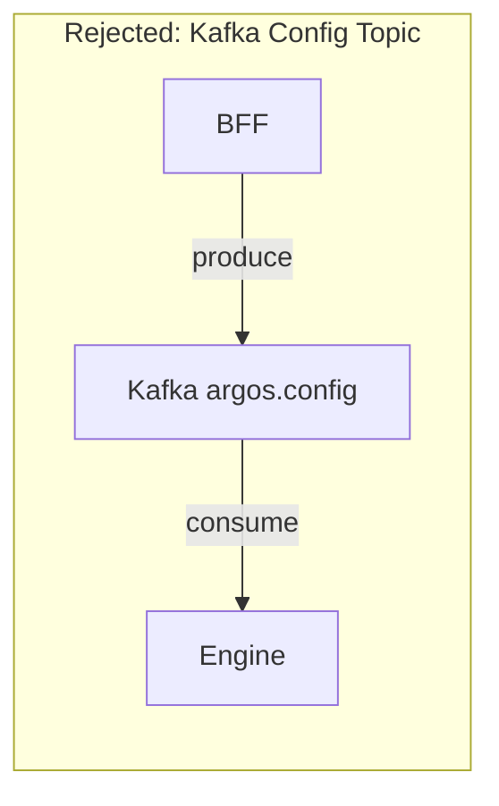
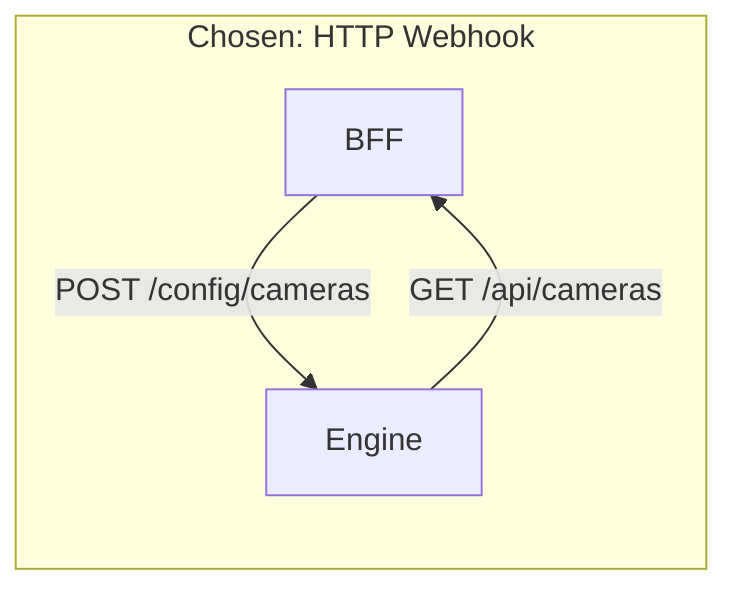
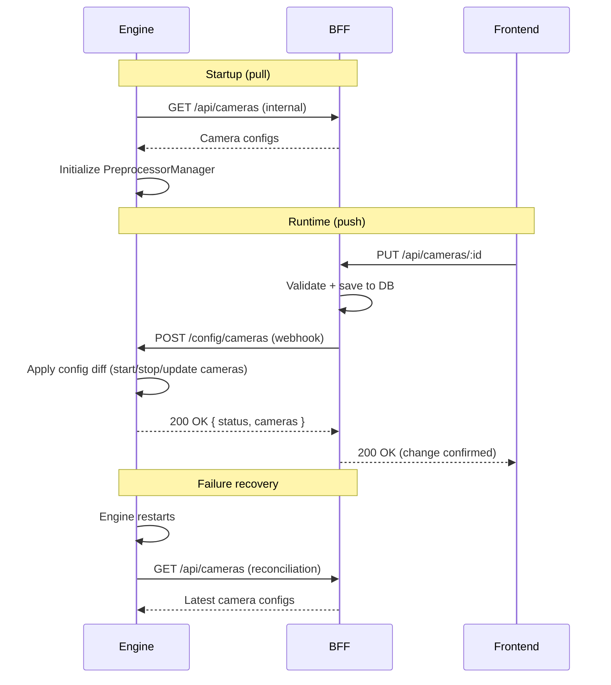

# ADR-003: Webhook for Configuration Propagation (BFF to Engine)

**Status:** Accepted
**Date:** February 2026

## Context

The BFF manages camera configurations (CRUD via REST API). When an operator creates, updates, or deletes a camera, the Engine must apply that change in real-time without restarting. We needed to decide how the BFF notifies the Engine of configuration changes.

## Options

### Option A: Kafka `argos.config` Topic (Rejected)

The BFF produces configuration change messages to a dedicated Kafka topic (`argos.config`). The Engine runs a Kafka consumer that subscribes to this topic and applies changes.



**Pros:**
- Decoupled: BFF doesn't need to know Engine's address
- Guaranteed delivery via Kafka offset management
- Multi-instance Engine fanout via consumer groups

**Cons:**
- Overhead for low-frequency changes (a consumer running 24/7 for ~1 message/week)
- No immediate feedback: BFF can't confirm the Engine applied the change without a response topic or polling
- Kafka is already a heavy dependency; using it for rare config updates is disproportionate

### Option B: HTTP Webhook (Chosen)

The BFF sends an HTTP POST to the Engine when configuration changes. The Engine exposes a `/config/cameras` endpoint. On startup, the Engine pulls its initial configuration from the BFF.



**Pros:**
- Simple: Engine already runs FastAPI, adding an endpoint is trivial
- Proportional: no idle consumer for infrequent changes
- Immediate feedback: BFF receives a response confirming the change was applied
- Easy to debug: standard HTTP request/response visible in logs

**Cons:**
- Direct coupling: BFF must know the Engine's URL
- If Engine is down when BFF sends the webhook, the change is lost (mitigated by startup reconciliation)

## Decision

**HTTP Webhook** with a **pull-on-start, push-on-change** pattern:

1. **Startup:** Engine sends `GET` to BFF to fetch initial camera configuration
2. **Runtime:** BFF sends `POST` to Engine's `/config/cameras` endpoint when config changes
3. **Reconciliation:** If the webhook fails (Engine down), the next Engine startup fetches current config from BFF

Kafka is reserved for high-throughput, unidirectional data flows (`argos.events`: Engine to BFF).

### Configuration Flow

```
Startup:  Engine --GET /api/cameras (full config)--> BFF
Runtime:  BFF --POST /config/cameras--> Engine
          Engine responds 200 + updated status
Failure:  Engine restarts → pulls latest config from BFF
```



## Consequences

- Kafka usage is simplified: only `argos.events` topic (Engine produces, BFF consumes)
- The `argos.config` Kafka topic is removed from the architecture
- BFF requires `ENGINE_URL` environment variable to send webhooks
- Engine requires `ARGOS_BFF_BASE_URL` for startup config fetch (already exists in settings)
- Engine must implement a `POST /config/cameras` endpoint with diff logic (add/remove/update cameras)
- If the Engine is unreachable during a webhook, BFF should mark the change as pending and rely on startup reconciliation
