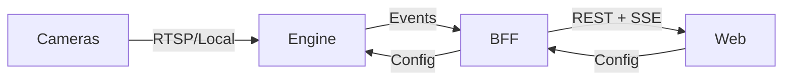

# Architecture Overview

Argos is a real-time video surveillance system that uses AI to detect anomalies across multiple camera feeds.

## System Architecture

The system is composed of three main components:

| Component | Technology | Role |
|-----------|-----------|------|
| **Engine** | Python / FastAPI | Captures video, runs AI detection pipeline |
| **BFF** | TypeScript / Fastify | API gateway, config management, event distribution |
| **Web** | TypeScript / Next.js | Operator dashboard |



## Architecture Style

Argos adopts an **event-driven architecture for the real-time detection pipeline**, complemented by **synchronous HTTP for configuration and management**:

| Flow | Pattern | Mechanism |
|------|---------|----------|
| Detection events (Engine → BFF → Web) | Event-driven | NATS pub/sub + SSE |
| Configuration management (Web → BFF → Engine) | Request/Response | REST + HTTP webhook |
| CRUD operations (Web ↔ BFF) | Request/Response | REST API |

This hybrid approach keeps the real-time path fully decoupled and reactive, while configuration flows remain simple and synchronous.

## Engine Pipeline

Each camera runs an independent concurrent pipeline:

```
Camera → PreProcessor → FrameBuffer → VLM → Description → Aggregator → Story → StoriesBuffer → LLM → Event → EventNormalizer → Publisher
```

Stages are decoupled via buffers. Each camera has two independent asyncio tasks (`vlm_loop` and `llm_loop`) that run concurrently with all other cameras — no camera blocks another. See the [Concurrency Model](../engine/TECHNICAL_BLUEPRINT.md#concurrency-model) section of the Technical Blueprint for details.

**Detailed diagrams:**

- [Full system architecture](architecture.mmd)
- [Engine class diagram](class-diagram-engine.mmd)
- [Engine packages](packages-engine.mmd)
- [BFF components](components-bff.mmd)
- [Communication sequence](sequence-communication.mmd)

## Data Flow

The following describes the flow **per camera**. All cameras execute these steps concurrently.

1. **Cameras** stream video to the Engine via RTSP or local device
2. **PreProcessor** captures frames on a dedicated OS thread, resizes them, and pushes to the camera's FrameBuffer
3. **FrameBuffer** accumulates frames until threshold; the camera's `vlm_loop` asyncio task flushes it
4. **VLM** describes frame contents in natural language → `Description` (async HTTP call; concurrent across cameras)
5. **Aggregator** enriches descriptions with source frames → `Story`
6. **StoriesBuffer** accumulates stories; when threshold is reached, `vlm_loop` signals `llm_loop` via `asyncio.Event`
7. **LLM** analyzes stories over time, emits `Event` if anomaly detected (async HTTP call; concurrent across cameras)
8. **EventNormalizer** runs validation commands (confidence check, severity normalization, metadata cleanup, frame encoding)
9. **Publisher** sends normalized events to NATS (see [ADR-007](../adr/007-broker.md))
10. **BFF** consumes events, stores in DB, and fans out to the Web via SSE
11. **Web** displays events and camera feeds to operators

## Configuration Flow

Uses a **pull-on-start, push-on-change** pattern via HTTP (see [ADR-003](../adr/003-config-propagation-webhook.md)):

1. **Startup:** Engine fetches initial camera config from BFF (`GET /api/cameras`)
2. **Runtime:** Operator changes config via **Web** → **BFF** validates, saves to DB, sends webhook to Engine (`POST /config/cameras`)
3. **Engine** applies config diff (start/stop/update camera threads) and responds with status
4. **Recovery:** If Engine was down during a webhook, it reconciles on next startup by pulling from BFF
