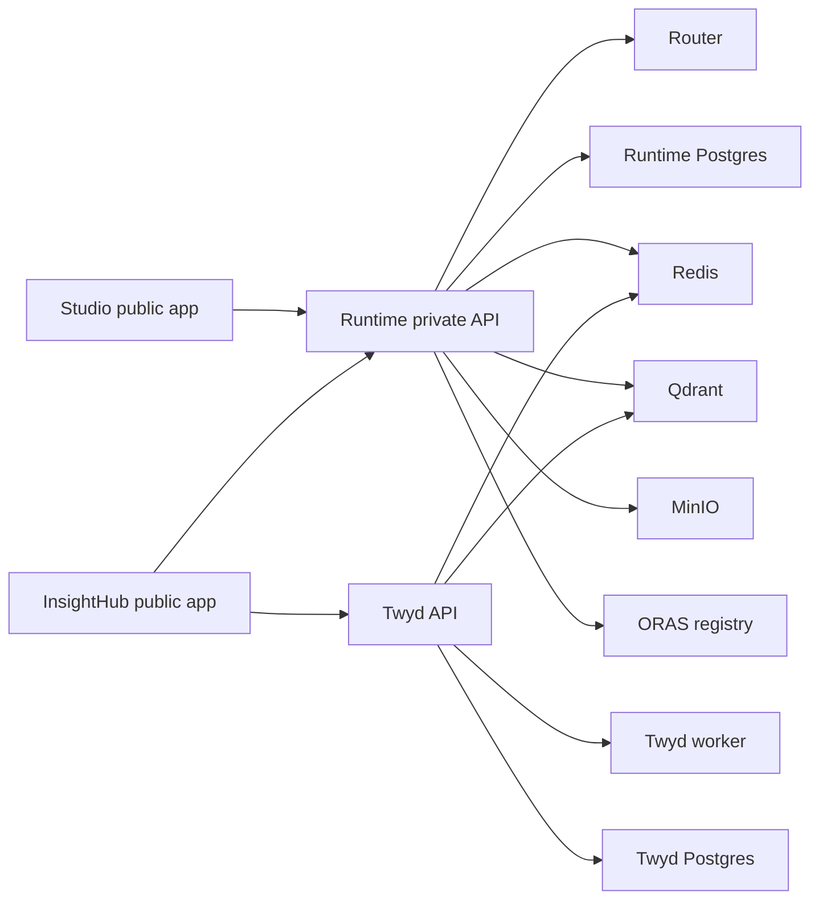

The Railway template deploys the full Alquimia Mini stack into a clean Railway project. You provide only secrets; the template creates services, private networking, public domains, volumes, start commands, health checks, and non-secret variables.

## What the template deploys



Studio and InsightHub receive public Railway domains. Every other service stays private on Railway internal DNS.

## Required secrets

| Secret | Used by | Notes |
| --- | --- | --- |
| `AUTH_LITE_USERS` | Studio, InsightHub | JSON array of Lite users. Each `password_hash` is a base64-encoded bcrypt hash. |
| `DEFAULT_RESPONSE_PROVIDER_API_KEY` | Runtime | LLM provider key for the default agentspace. |
| `HF_EMBEDDINGS_URL` | Twyd | External embeddings endpoint URL. |
| `DEFAULT_RESPONSE_PROVIDER_BASE_URL` | Runtime | Optional; set only for providers that need a custom base URL. |

The template generates internal service credentials such as `API_TOKEN`, `NEXTAUTH_SECRET`, database passwords, and MinIO credentials. Alquimia-owned Docker image credentials are hidden in the template.

Generate `AUTH_LITE_USERS` from the Studio repo:

```sh
yarn hash-password
```

Then encode the bcrypt hash as base64 and place it in:

```json
[{"email":"admin@example.com","name":"Admin","password_hash":"<base64-bcrypt-hash>"}]
```

## Deploy

1. Open the Alquimia Mini Railway template link provided by Alquimia.
2. Choose a Railway workspace and create a new project.
3. Enter the required secrets.
4. Deploy the template.
5. Wait until `runtime`, `studio`, `insight-hub`, `twyd-api`, `twyd-worker`, `runtime-postgres`, `twyd-postgres`, `redis`, `qdrant`, `minio`, and `oras-registry` are healthy.
6. Open the generated Studio domain and sign in with a user from `AUTH_LITE_USERS`.
7. Open the generated InsightHub domain and sign in with the same user.

## Smoke checks

Set the generated public URLs locally:

```sh
export STUDIO_URL=https://<studio-domain>
export INSIGHT_HUB_URL=https://<insight-hub-domain>
```

Run:

```sh
curl -fsS "$STUDIO_URL" >/dev/null
curl -fsS "$INSIGHT_HUB_URL" >/dev/null
```

From the Railway shell for each private service:

```sh
curl -fsS http://localhost:8080/health/readiness
curl -fsS http://localhost:8000/openapi.json >/dev/null
```

## Full E2E validation

1. In Studio, create or open an agent configured with the default response provider.
2. Send a short test inference and confirm Runtime responds.
3. In InsightHub, create a topic.
4. Upload a small document to the topic.
5. Wait for the Twyd worker task to finish.
6. Ask a question about the uploaded document and confirm the answer uses document context.
7. Restart the stateful services and confirm agents, topics, documents, indexes, and registry artifacts remain.

## Cost estimate

Railway bills a plan subscription plus consumed resources. As of May 28, 2026, Railway lists these resource prices:

| Resource | Price |
| --- | ---: |
| RAM | `$10 / GB / month` |
| CPU | `$20 / vCPU / month` |
| Network egress | `$0.05 / GB` |
| Volume storage | `$0.15 / GB / month` |

The current Alquimia Mini E2E baseline observed in Railway is about `$53.58 / month` for compute and about `$2.10 / month` for 14 GB of starting volume storage, before plan subscription, network egress, and external LLM or embeddings usage.

Twyd worker memory dominates the baseline. Recalculate from Railway metrics after running representative workloads.

## Troubleshooting

| Symptom | Check |
| --- | --- |
| Private image pull fails | The template maintainer must configure hidden registry credentials for every private `alquimiaai/*` image. Deployer DockerHub credentials should not be required. |
| Runtime health check fails | Confirm `API_TOKEN`, Postgres variables, Redis URL, and `ALQUIMIA_REGISTRY_SECRET_RESOLVER=env` are present on `runtime`. |
| Inference hangs or fails resolving secrets | Confirm `DEFAULT_RESPONSE_PROVIDER_API_KEY` is set on `runtime`. Vault is not part of the official Railway template path. |
| Studio or InsightHub redirects incorrectly | Confirm `NEXTAUTH_URL` and `NEXT_PUBLIC_APP_URL` resolve to the service's Railway public domain. |
| Private DNS fails | Confirm services are in the same Railway project environment and use `<service>.railway.internal` names. |
| Uploaded documents disappear after restart | Confirm volumes are attached to `twyd-api`, `qdrant`, and `minio`. |
