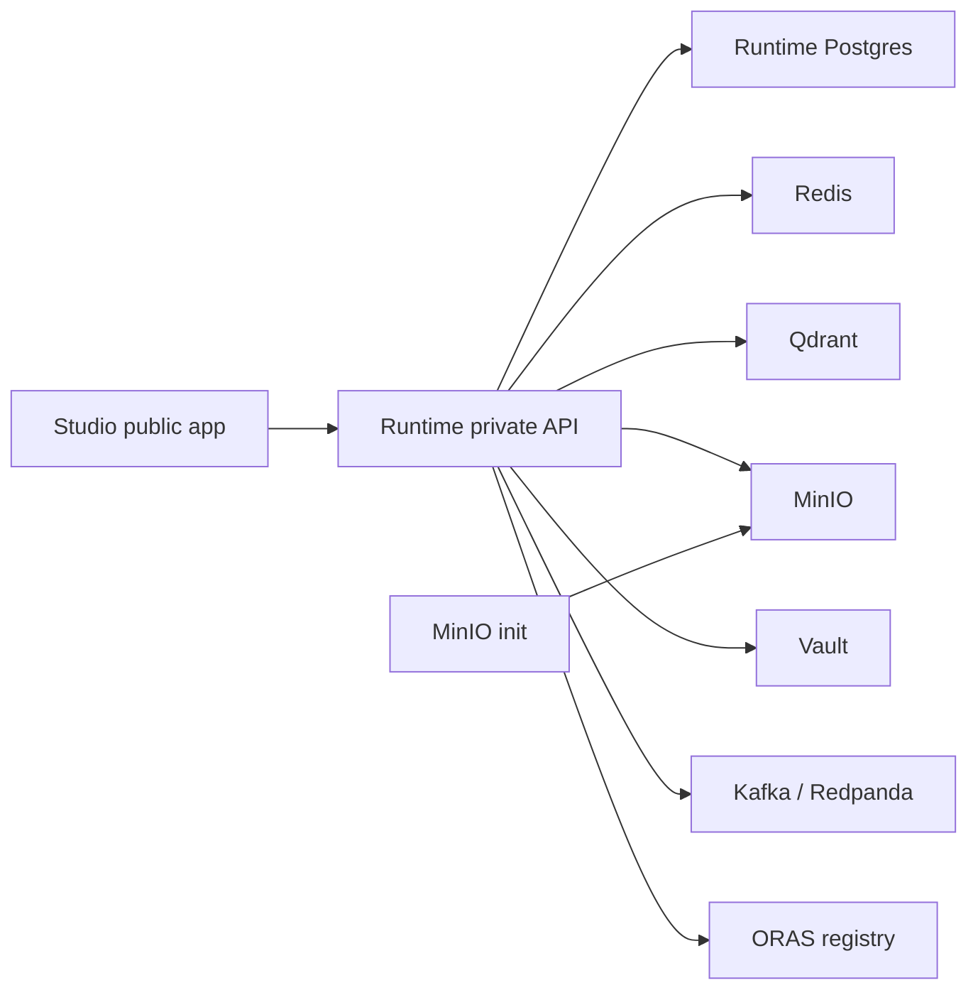

The Railway template deploys the Studio path for Alquimia Stack into a clean Railway project. It creates Studio, Runtime, and the infrastructure services required for agent creation, model configuration, inference, registry storage, secrets, and persistence.

The template also configures private networking, public domains, volumes, start commands, health checks, hidden Docker image credentials, generated internal secrets, and non-secret variables.

Use the public Railway template as the recommended deployment path:

[Deploy Alquimia Stack on Railway](https://railway.com/deploy/alquimia-stack-2)

## What the template deploys


```mermaid
flowchart LR
  Studio["Studio public app"] --> Runtime["Runtime private API"]
  Runtime --> RuntimeDB["Runtime Postgres"]
  Runtime --> Redis["Redis"]
  Runtime --> Qdrant["Qdrant"]
  Runtime --> MinIO["MinIO"]
  MinIOInit["MinIO init"] --> MinIO
  Runtime --> Vault["Vault"]
  Runtime --> Kafka["Kafka / Redpanda"]
  Runtime --> ORAS["ORAS registry"]
```

Studio receives a public Railway domain. Runtime and infrastructure services communicate through Railway private networking unless a public Runtime domain is enabled by the template for integrations.

## Required input

The default Railway UI deploy does not require user-provided variables before the first deploy. The template preconfigures Lite authentication and generates internal service credentials such as `API_TOKEN`, `NEXTAUTH_SECRET`, `VAULT_TOKEN`, database passwords, MinIO credentials, and Vault runtime credentials. Alquimia-owned Docker image credentials are hidden in the template, so deployers do not need DockerHub credentials.

Model provider keys are added from Studio after deployment. Studio sends the secret value to Runtime, and Runtime stores it in Vault for inference-time resolution.

## Default login

The template includes a default Lite user:

| Field | Value |
| --- | --- |
| Email | `admin@alquimia.ai` |
| Password | `alquimia` |

Replace the default Lite user before using the deployment for shared environments, customer demos, or any environment with real data.

To override the default user, set `AUTH_LITE_USERS` on `studio`. Generate a password hash from the Studio repo:

```sh
yarn hash-password <password>
```

Use the generated base64 bcrypt hash in this JSON shape:

```json
[{"email":"admin@example.com","name":"Admin","password_hash":"<base64-bcrypt-hash>"}]
```

## Deploy from Railway

1. Open [Deploy Alquimia Stack](https://railway.com/deploy/alquimia-stack-2).
2. Click `Deploy Now`.
3. Choose a Railway workspace and create a new project.
4. Deploy the template.
5. Wait until `runtime`, `studio`, `runtime-postgres`, `redis`, `qdrant`, `minio`, `minio-init`, `vault`, `kafka`, and `oras-registry` are healthy.
6. Open the generated Studio domain.
7. Sign in with `admin@alquimia.ai` and password `alquimia`.
8. In Studio, add a model connection and paste the provider API key.
9. Create or open an agent and run a test inference.

## Maintainer: create or update the template

Railway does not deploy directly from repository files. The actual Railway template is generated from a clean Railway seed project that maintainers configure and validate before publishing.

Use a clean seed project that matches the Studio-only template exactly:

- Service names match the Studio-only template, including `vault`.
- Internal URLs use Railway variable references such as `${{runtime.RAILWAY_PRIVATE_DOMAIN}}`.
- Studio has a public domain.
- Stateful services have volumes.
- Private `alquimiaai/*` images have hidden maintainer registry credentials.
- Runtime uses `ALQUIMIA_REGISTRY_SECRET_RESOLVER=vault`.
- The default Lite user is preconfigured as `admin@alquimia.ai` with password `alquimia`.

Generate an unpublished template from the seed project:

```sh
railway templates create \
  --project <seed-project-id> \
  --environment production \
  --json
```

Railway returns a template id. Publish or update the template with the public README:

```sh
railway templates publish <template-id> \
  --category AI/ML \
  --description "Deploy Alquimia Stack on Railway" \
  --readme-file /path/to/alquimia-railway/template/template-readme.md \
  --json
```

For a staging-only draft, you can generate from a staging environment:

```sh
railway templates create \
  --project <seed-project-id> \
  --environment staging \
  --json
```

Do not publish a template generated from an ad-hoc test environment unless service names, variables, volumes, registry credentials, and Railway variable references match the official Studio-only template.

## Smoke checks

Set the generated public URLs locally:

```sh
export STUDIO_URL=https://<studio-domain>
```

Run:

```sh
curl -fsS "$STUDIO_URL" >/dev/null
```

From the Railway shell for each private service:

```sh
curl -fsS http://localhost:8080/health/readiness
```

## Studio validation

1. In Studio, add a model connection and confirm the connection uses a Vault-backed secret name.
2. Create or open an agent configured with that model connection.
3. Send a short test inference and confirm Runtime responds.
4. If using the knowledge base flow, upload a small document from Studio and confirm the agent can use it.
5. Restart `runtime`, `studio`, `runtime-postgres`, `qdrant`, `minio`, `vault`, and `oras-registry`.
6. Confirm agents, model connections, uploaded artifacts, registry artifacts, and indexes remain available.

## Cost estimate

Railway bills a plan minimum plus consumed resources. As of June 23, 2026, Railway lists these resource prices in its [pricing docs](https://docs.railway.com/pricing/plans):

| Resource | Price |
| --- | ---: |
| RAM | `$10 / GB / month` |
| CPU | `$20 / vCPU / month` |
| Network egress | `$0.05 / GB` |
| Volume storage | `$0.15 / GB / month` |

For an idle-to-light Studio-only deployment, use this planning baseline:

| Service group | Services | Estimated monthly Railway usage |
| --- | --- | ---: |
| Studio app | `studio` | `$1-3` |
| Runtime API and registry | `runtime` | `$3-5` |
| Runtime database | `runtime-postgres` | `$1-2` |
| Cache | `redis` | `<$1` |
| Vector store | `qdrant` | `$1-2` |
| Object storage | `minio`, `minio-init` | `$1-2` |
| Secret store | `vault` | `$1-2` |
| Event bus | `kafka` / Redpanda | `$5-7` |
| OCI registry | `oras-registry` | `<$1` |
| **Estimated total** | Studio-only template | **`$15-25 / month`** |

This estimate excludes the Railway plan minimum, network egress, and external LLM provider usage. Kafka/Redpanda is usually the largest idle component because the template reserves a 512 MB broker target. Recalculate from the Railway project's Usage tab after running representative workloads.

## Troubleshooting

| Symptom | Check |
| --- | --- |
| Private image pull fails | The template maintainer must configure hidden registry credentials for every private `alquimiaai/*` image. Deployer DockerHub credentials should not be required. |
| Runtime health check fails | Confirm `API_TOKEN`, Postgres variables, Redis URL, Vault variables, and `ALQUIMIA_REGISTRY_SECRET_RESOLVER=vault` are present on `runtime`. |
| Inference hangs or fails resolving secrets | Confirm `vault` is healthy, Runtime points to `http://vault.railway.internal:8200`, and the model connection was saved from Studio with a secret value. |
| Studio redirects incorrectly | Confirm `NEXTAUTH_URL` and `NEXT_PUBLIC_APP_URL` resolve to the Studio Railway public domain. |
| Private DNS fails | Confirm services are in the same Railway project environment and use `<service>.railway.internal` names. |
| Uploaded artifacts disappear after restart | Confirm volumes are attached to `runtime`, `qdrant`, `minio`, and `oras-registry`. |
