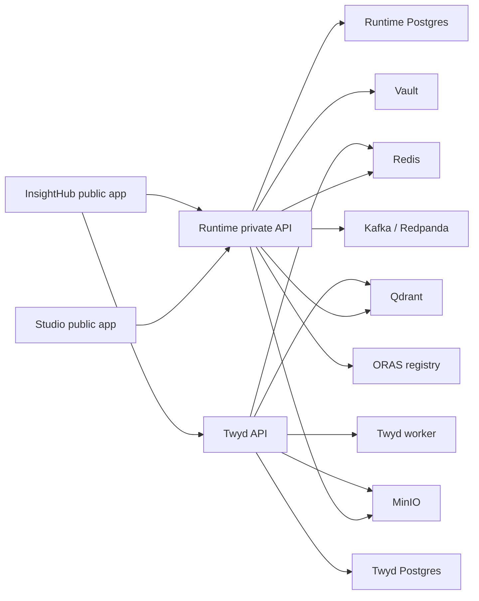

The Railway template deploys the full Alquimia Stack into a clean Railway project. It creates the services, private networking, public domains, volumes, start commands, health checks, hidden Docker image credentials, generated internal secrets, and non-secret variables required to run Alquimia end to end.

Use the public Railway template as the recommended deployment path:

[Deploy Alquimia Stack on Railway](https://railway.com/deploy/alquimia-stack-2)

## What the template deploys


```mermaid
flowchart LR
  Studio["Studio public app"] --> Runtime["Runtime private API"]
  InsightHub["InsightHub public app"] --> Runtime
  InsightHub --> TwydAPI["Twyd API"]
  TwydAPI --> TwydWorker["Twyd worker"]
  Runtime --> RuntimeDB["Runtime Postgres"]
  TwydAPI --> TwydDB["Twyd Postgres"]
  Runtime --> Redis["Redis"]
  TwydAPI --> Redis
  Runtime --> Qdrant["Qdrant"]
  TwydAPI --> Qdrant
  Runtime --> MinIO["MinIO"]
  TwydAPI --> MinIO
  Runtime --> Vault["Vault"]
  Runtime --> Kafka["Kafka / Redpanda"]
  Runtime --> ORAS["ORAS registry"]
```

Studio and InsightHub receive public Railway domains. Every other service stays private on Railway internal DNS.

## Required input

| Input | Used by | Notes |
| --- | --- | --- |
| `HF_EMBEDDINGS_URL` | Twyd | External embeddings endpoint URL. |

The template preconfigures Lite authentication and generates internal service credentials such as `API_TOKEN`, `NEXTAUTH_SECRET`, `VAULT_TOKEN`, database passwords, MinIO credentials, and Vault runtime credentials. Alquimia-owned Docker image credentials are hidden in the template, so deployers do not need DockerHub credentials.

Model provider keys are added from Studio after deployment. Studio sends the secret value to Runtime, and Runtime stores it in Vault for inference-time resolution.

## Default login

The template includes a default Lite user:

| Field | Value |
| --- | --- |
| Email | `admin@alquimia.ai` |
| Password | `alquimia` |

Replace the default Lite user before using the deployment for shared environments, customer demos, or any environment with real data.

To override the default user, set `AUTH_LITE_USERS` on `studio` and `insight-hub`. Generate a password hash from the Studio repo:

```sh
yarn hash-password <password>
```

Use the generated base64 bcrypt hash in this JSON shape:

```json
[{"email":"admin@example.com","name":"Admin","password_hash":"<base64-bcrypt-hash>"}]
```

## Deploy from Railway

1. Open [Deploy Alquimia Stack](https://railway.com/deploy/alquimia-stack-2).
2. Click `Deploy Now`.
3. Choose a Railway workspace and create a new project.
4. Enter the required external secret: `HF_EMBEDDINGS_URL`.
5. Deploy the template.
6. Wait until `runtime`, `studio`, `insight-hub`, `twyd-api`, `twyd-worker`, `runtime-postgres`, `twyd-postgres`, `redis`, `qdrant`, `minio`, `vault`, `kafka`, and `oras-registry` are healthy.
7. Open the generated Studio domain.
8. Sign in with `admin@alquimia.ai` and password `alquimia`.
9. In Studio, add a model connection and paste the provider API key.
10. Open the generated InsightHub domain and sign in with the same default user.

## Advanced: deploy from the CLI

You can also clone the Alquimia Railway repo and deploy the official Railway template from your terminal. This still uses the published Railway template under the hood, so Alquimia-owned private image credentials stay hidden from deployers. The direct Railway template flow above is the recommended path.

Install and authenticate the Railway CLI:

```sh
railway login
```

Clone the deployment repo:

```sh
git clone https://github.com/Alquimia-ai/alquimia-railway.git
cd alquimia-railway
```

The current helper expects `AUTH_LITE_USERS` so it can pass either the default user or a replacement during deployment. To keep the documented default login, run:

```sh
AUTH_LITE_USERS='[{"email":"admin@alquimia.ai","name":"Alquimia Admin","password_hash":"JDJiJDEwJFhNbHF6VXNMNzFzQzU5QlNBVXoxZ3V0T2dIdjlzNDZlU0t6L1pwUVBuL3hNUUk1dXZudUpL"}]' \
HF_EMBEDDINGS_URL='https://embeddings.example.com' \
./scripts/deploy-template.sh
```

To replace the default user, pass a custom `AUTH_LITE_USERS` value:

```sh
AUTH_LITE_USERS='[{"email":"admin@alquimia.ai","name":"Alquimia Admin","password_hash":"<base64-bcrypt-hash>"}]' \
HF_EMBEDDINGS_URL='https://embeddings.example.com' \
./scripts/deploy-template.sh
```

If the directory is not linked to a Railway project, the helper creates a project named `Alquimia Mini`. Override the name with:

```sh
RAILWAY_PROJECT_NAME="My Alquimia Runtime" \
AUTH_LITE_USERS='[{"email":"admin@alquimia.ai","name":"Alquimia Admin","password_hash":"JDJiJDEwJFhNbHF6VXNMNzFzQzU5QlNBVXoxZ3V0T2dIdjlzNDZlU0t6L1pwUVBuL3hNUUk1dXZudUpL"}]' \
HF_EMBEDDINGS_URL='https://embeddings.example.com' \
./scripts/deploy-template.sh
```

The helper does not build the stack from the repository blueprint. It provisions the official Railway template. This is required so deployers do not need DockerHub credentials for private `alquimiaai/*` images.

The helper defaults to the private Alquimia Railway template code `TdYC1q`. Maintainers can override it by setting `ALQUIMIA_RAILWAY_TEMPLATE_CODE`.

## Maintainer: create or update the template

Railway does not deploy directly from the Alquimia Railway blueprint file. The blueprint in the Alquimia Railway repository is the maintainer source of truth for how the Railway project must be configured. The actual Railway template is generated from a clean Railway seed project.

Use a clean seed project that matches the blueprint exactly:

- Service names match the blueprint, including `vault`.
- Internal URLs use Railway variable references such as `${{runtime.RAILWAY_PRIVATE_DOMAIN}}`.
- Studio and InsightHub have public domains.
- Stateful services have volumes.
- Private `alquimiaai/*` images have hidden maintainer registry credentials.
- Runtime uses `ALQUIMIA_REGISTRY_SECRET_RESOLVER=vault`.
- The default Lite user is preconfigured as `admin@alquimia.ai` with password `alquimia`.

Generate an unpublished template from the seed project:

```sh
railway templates create \
  --project <seed-project-id> \
  --environment production \
  --json
```

Railway returns a template id. Publish or update the template with the public README:

```sh
railway templates publish <template-id> \
  --category AI/ML \
  --description "Deploy Alquimia Mini Full E2E on Railway" \
  --readme-file /path/to/alquimia-railway/template/template-readme.md \
  --json
```

For a staging-only draft, you can generate from a staging environment:

```sh
railway templates create \
  --project <seed-project-id> \
  --environment staging \
  --json
```

Do not publish a template generated from an ad-hoc test environment unless service names, variables, volumes, registry credentials, and Railway variable references match the official blueprint.

## Smoke checks

Set the generated public URLs locally:

```sh
export STUDIO_URL=https://<studio-domain>
export INSIGHT_HUB_URL=https://<insight-hub-domain>
```

Run:

```sh
curl -fsS "$STUDIO_URL" >/dev/null
curl -fsS "$INSIGHT_HUB_URL" >/dev/null
```

From the Railway shell for each private service:

```sh
curl -fsS http://localhost:8080/health/readiness
curl -fsS http://localhost:8000/openapi.json >/dev/null
```

## Full E2E validation

1. In Studio, add a model connection and confirm the connection uses a Vault-backed secret name.
2. Create or open an agent configured with that model connection.
3. Send a short test inference and confirm Runtime responds.
4. In InsightHub, create a topic.
5. Upload a small document to the topic.
6. Wait for the Twyd worker task to finish.
7. Ask a question about the uploaded document and confirm the answer uses document context.
8. Restart the stateful services and confirm agents, topics, documents, indexes, and registry artifacts remain.

## Cost estimate

Railway bills a plan subscription plus consumed resources. As of May 28, 2026, Railway lists these resource prices:

| Resource | Price |
| --- | ---: |
| RAM | `$10 / GB / month` |
| CPU | `$20 / vCPU / month` |
| Network egress | `$0.05 / GB` |
| Volume storage | `$0.15 / GB / month` |

The current Alquimia Mini E2E baseline observed in Railway is about `$53.58 / month` for compute and about `$2.10 / month` for 14 GB of starting volume storage, before plan subscription, network egress, and external LLM or embeddings usage.

Twyd worker memory dominates the baseline. Recalculate from Railway metrics after running representative workloads.

## Troubleshooting

| Symptom | Check |
| --- | --- |
| Private image pull fails | The template maintainer must configure hidden registry credentials for every private `alquimiaai/*` image. Deployer DockerHub credentials should not be required. |
| Runtime health check fails | Confirm `API_TOKEN`, Postgres variables, Redis URL, Vault variables, and `ALQUIMIA_REGISTRY_SECRET_RESOLVER=vault` are present on `runtime`. |
| Inference hangs or fails resolving secrets | Confirm `vault` is healthy, Runtime points to `http://vault.railway.internal:8200`, and the model connection was saved from Studio with a secret value. |
| Studio or InsightHub redirects incorrectly | Confirm `NEXTAUTH_URL` and `NEXT_PUBLIC_APP_URL` resolve to the service's Railway public domain. |
| Private DNS fails | Confirm services are in the same Railway project environment and use `<service>.railway.internal` names. |
| Uploaded documents disappear after restart | Confirm volumes are attached to `twyd-api`, `qdrant`, and `minio`. |
