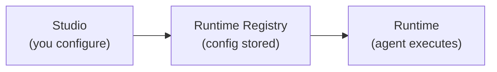

Alquimia is a complete AI runtime ecosystem for building and running enterprise-ready AI agents with a focus on transparency, consistency, and flexibility. **Studio** is the visual interface where you configure agents. The **Runtime** is where they actually run. **InsightHub** is the knowledge exploration front end that lets teams converse with their documents. These products share a single backend — you don't need to know about every layer to get started, but understanding the big picture helps.

{/* screenshot: alquimia-ecosystem-diagram */}

## The ecosystem at a glance

| Component | Role |
|-----------|------|
| **Studio** | Agent builder — design, configure, and manage agents. Agent health dashboards are powered by **Prometheus**, which collects metrics from Runtime, Studio, and InsightHub via the shared OTel pipeline. |
| **Runtime** | Event-driven execution platform for agents. Orchestrates inference, multi-agent runs, context-aware prompting, memory strategies, tool execution, and channel connectors. Built for Kubernetes and OpenShift deployments. |
| **InsightHub** | AI-powered knowledge exploration — create **Topics**, upload documents, and explore them through streaming AI conversation powered by the Runtime. |
| **Twyd** | Knowledge base service. Handles document ingestion, topic management, and vector search. Used by InsightHub and the Runtime for RAG retrieval. |

## The agent lifecycle

When you build an agent in Studio, here's what happens end-to-end:

1. You configure an agent in Studio (model, system prompt, tools, memory, etc.)
2. Studio saves the configuration to the **Runtime Registry** — the central store for all agent configs
3. When a user sends a message, the Runtime fetches the agent config from the Registry
4. The Runtime executes the agent: constructs the prompt, calls the LLM, runs tools if needed, applies memory
5. Telemetry from the run — along with telemetry from Studio and InsightHub — flows through the shared **OpenTelemetry** pipeline; **Prometheus** collects the metrics and feeds Studio's dashboards, where you review agent health and usage

## Next steps

<CardGroup cols={2}>
  <Card title="Ecosystem overview" icon="diagram-project" href="/products/studio/getting-started/ecosystem-overview">
    See every service, its port, and what it does.
  </Card>
  <Card title="Installation" icon="rocket" href="/getting-started/installation">
    Get the stack running locally with Docker Compose.
  </Card>
</CardGroup>
