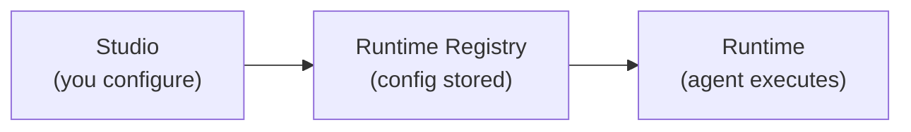

**Alquimia** is a platform for running enterprise level AI assistants on your own infrastructure: you design how agents behave, you ground them in your documents when needed, and everything executes in one place behind the scenes.

**[Alquimia Studio](/products/studio/index)** is where you build and operate agents — the place teams live day to day for configuration and health.

**[InsightHub](/products/insight-hub/index)** is for knowledge work: topics, uploads, and guided exploration over your content, still powered by the same agents and execution stack.

**[Alquimia Core & Runtime](/platform/runtime)** is that shared execution layer — Core is the SDK that drives the inference pipeline, tool ecosystem, memory strategies, and agent registry; Runtime is the FastAPI service that runs it all in production, wiring multi-channel connectors and coordinating agent work over a CloudEvents-based event model.

{/* screenshot: alquimia-ecosystem-diagram */}

## The ecosystem at a glance

| Piece | What it is |
|-------|----------------|
| **Studio** | Where you create and manage agents and workspace settings. |
| **InsightHub** | Where you structure documents and explore them in conversation. |
| **Core & Runtime** | The inference and orchestration layer. **Core** is the SDK: inference pipeline (shields, generation, tools, memory, empathy engine), multi-provider LLM connectors, a unified tool layer (MCP, Llama Stack, built-ins, A2A), and the agent registry. **Runtime** is the FastAPI service that runs it: inference API, multi-channel connectors (Slack, WhatsApp, Email), and CloudEvents-based event orchestration. |
| **Twyd** | The knowledge service behind document ingestion and search used when answers must stay close to your files. |

## The agent lifecycle

When you build an agent in Studio, here's what happens end-to-end:

1. You configure an agent in Studio.
2. That configuration is stored in the **Runtime Registry**.
3. When someone chats — in Studio, InsightHub, or a connected channel (Slack, WhatsApp, Email) — the Runtime loads that configuration and runs it through the Core inference pipeline end to end.
4. Usage and health show up in the observability setup your team configured; Studio is the usual place to review agent-focused metrics.

## Next steps

<CardGroup cols={2}>
  <Card title="Ecosystem overview" icon="diagram-project" href="/products/studio/getting-started/ecosystem-overview">
    See every service, its port, and what it does.
  </Card>
  <Card title="Installation" icon="rocket" href="/getting-started/installation">
    Get the stack running locally with Docker Compose.
  </Card>
</CardGroup>

If you are extending, integrating, or deploying the execution layer itself, the reference material lives on the **[Alquimia Runtime documentation site](https://alquimia-runtime-sdk.stldocs.app/)** (CLI, SDK, HTTP API, and operations).
