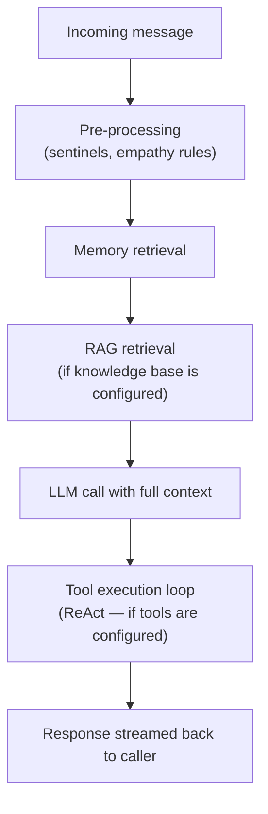

Alquimia Runtime is the backend engine that every product in the platform calls. It handles AI inference, manages agent configuration, runs channel connectors, and coordinates multi-agent workflows. Studio and InsightHub are both front ends that sit on top of it.

## What the Runtime does

### Inference engine

Accepts inference requests via a REST API and streams responses back over Server-Sent Events (SSE). Each request moves through a fixed pipeline:

Clients can subscribe to a **stream ID** via SSE to observe every step in real time: retrieval events, tool calls and results, reasoning steps, and the final response.

### Agent registry

Stores all agent configuration: model, system prompt, tools, memory strategy, integration channels, secrets, and parameters. The registry is backed by an OCI-compatible store, which means agent packages can be published, versioned, and pulled across environments.

Studio writes to this registry when you save an agent. The Runtime reads from it on every inference call.

### Channel connectors

Bidirectional connectors for **Slack**, **WhatsApp**, and **Email**. Inbound messages arrive at a connector endpoint, get dispatched through the inference engine, and the response is delivered back to the originating channel — including chunking for platforms with message size limits.

### Agent-to-Agent (A2A)

Agents can delegate work to other agents registered in the same Runtime. The Runtime manages call depth, response polling, and timeouts. From the caller's perspective, the delegated response arrives as part of the same inference stream.

### Observability

Exports **OpenTelemetry** traces, logs, and metrics to the shared collector. Metrics are scraped by **Prometheus** and surfaced in Studio's agent health dashboards. Trace context propagates across A2A calls so distributed inference chains are fully traceable end-to-end. Runtime is one of several exporters — Studio and InsightHub export their own telemetry to the same pipeline.

## Infrastructure dependencies

| Service | Purpose |
|---------|---------|
| **Redis** | Chat history, event stream state, distributed locking |
| **S3 / MinIO** | Blob and file storage for inference attachments |
| **HashiCorp Vault** | Secret resolution for agent credentials |
| **Twyd** | Document indexing and vector search (used for RAG retrieval) |

## How Studio and InsightHub use it

- **Studio** is the application layer for building agents. Every agent you author in Studio is stored in the Runtime's Registry and executes in the Runtime. Studio does not run inference — it is where agents are defined, managed, and monitored. Agent telemetry flows from the Runtime back to Studio's dashboards.
- **InsightHub** calls the Runtime's inference API for every exploration message. The Runtime retrieves document chunks from Twyd and streams the complete response — including reasoning steps — back to InsightHub.

## Full documentation

Full Runtime technical documentation is maintained in the Runtime repository and will be synced here. For the platform-level picture, see the [platform overview](/platform/overview).
