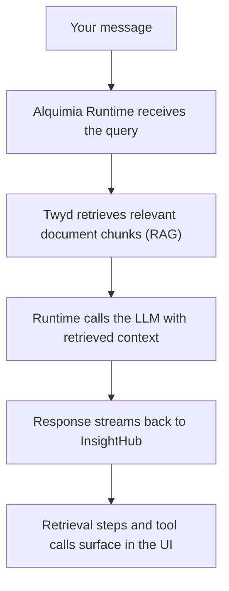

InsightHub is the knowledge exploration front end of the Alquimia platform. It is not an observability tool or an agent builder — it is a place to turn documents into a conversational knowledge base that anyone on your team can explore.

{/* screenshot: insight-hub-ecosystem-diagram */}

## Where InsightHub fits

| Component | What it does |
|-----------|-------------|
| **InsightHub** | The interface you work in — create topics, upload documents, start explorations. |
| **Alquimia Runtime** | The execution layer behind every conversation — retrieves relevant document passages, runs tools, and streams responses back. |
| **Twyd** | The knowledge service that handles document ingestion, chunking, and vector indexing. |

You do not interact with the Runtime or Twyd directly. InsightHub communicates with them on your behalf. You need a running Alquimia Runtime instance pointed to by `ASSISTANT_BASEURL`.

## How an exploration works

When you send a message in an exploration:

Responses are grounded in your uploaded documents — not generated from scratch. InsightHub shows you which documents were used and what reasoning steps the AI took.

## Multi-tenant and roles

InsightHub supports multiple tenants in a single deployment. Each tenant's topics and documents are scoped and isolated. Within a tenant, access is controlled by roles assigned to users.

<Note>
  If you are deploying InsightHub for your organization, your administrator configures tenants and user roles. You do not need to manage this yourself unless you are the operator.
</Note>

## Next steps

<CardGroup cols={2}>
  <Card title="Quick start" icon="rocket" href="/products/insight-hub/getting-started/quick-start">
    Get InsightHub running locally.
  </Card>
  <Card title="Topics and documents" icon="layers" href="/products/insight-hub/core-concepts/topics-and-documents">
    Understand the core building blocks.
  </Card>
</CardGroup>
